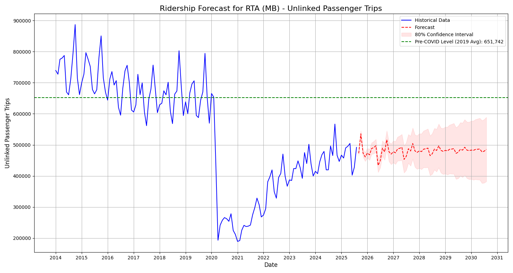

# Riverside Transit Recovery Analysis

### [Click Here to View the Interactive Network Analysis Map](https://jaimeval24.github.io/RTA_Ridership_Analysis/map/)

---

## 1. The Research Question
**“Will Riverside's public transportation ridership ever get back to its pre-COVID levels?”**

To investigate, we used data from the Department of Transportation, focusing on the **Riverside Transit Agency (RTA)**. Specifically, we analyzed **“Unlinked Passenger Trips”** for **Motorbus (MB)** service, as this is the primary mode of transit in the region.

* **Benchmark:** Pre-COVID levels (2019 Monthly Average): **651,742 trips**.
* **Training Data:** Post-COVID era starting **January 2021**.

---

## 2. Part I: Time Series Forecasting (SARIMA)

We used **SARIMA** (Seasonal AutoRegressive Integrated Moving Average) to model the recovery trajectory.

### Methodology
* **AR (AutoRegressive):** Captures how this month’s ridership depends on the previous months.
* **I (Integrated):** Tracks the overall trend (up, down, or flat).
* **MA (Moving Average):** Corrects past forecast errors.
* **S (Seasonal):** Detects repeating yearly patterns (summer dips, school-year peaks).

### Model Selection Process
Finding a stable model was challenging. A forecast isn’t useful if it’s unstable or doesn’t make sense.

Our first attempts (using complex manual parameters and a wide `auto_arima` search) **overfit the data**. The models clung too closely to recent noise rather than the overall trend.

**The Problem:**
Instead of a stable recovery, early models produced unrealistic forecasts, often predicting a **sharp, immediate nosedive** back to zero or exploding confidence intervals that made predictions meaningless. Narrowing the scope to a more reliable, simple forecast became our priority.

### The Final Model
To correct this, we restricted the search to find a **stable, linear trend** (`d=1`) and tested for a positive intercept. The result was a statistically sound model:

**`SARIMAX(1, 1, 0)x(1, 0, 0, 12)`**

Diagnostic tests confirmed the model captured the signal effectively:
* `Prob(Q) = 0.95` (Residuals are white noise)
* `Prob(JB) = 0.93` (Residuals are normally distributed)

**Coefficient Analysis:**

| Term | Coefficient | p-value | Interpretation |
|:---|---:|---:|:---|
| **`intercept`** | -2399.78 | **0.677** | **Not Significant** |
| `ar.L1` | -0.2979 | 0.020 | Significant |
| `ar.S.L12` | 0.3703 | 0.012 | Significant |

### The Verdict: Will it Recover?
**Short answer: No.**

The intercept p-value of **0.677** indicates that **there is no statistical evidence of growth.** The recovery trend seen in 2021–2023 has stalled. The model forecasts a flat trend line that stays significantly below the green pre-COVID baseline.

---

## 3. Part II: Spatial Analysis (Why is it stalling?)

If the data shows recovery has stalled, the next question is **"Why?"** To investigate structural barriers, we expanded the study to include a **Geospatial Network Analysis**.

Using **QGIS** and **Graph Theory algorithms** (`v.net.distance` and `QNEAT3`), we visualized the "First-Mile/Last-Mile" problem in Riverside. Unlike simple straight-line radius buffers, this analysis calculates the **actual walking distance** along the street network from residential properties (APN) to the nearest bus stop.

### Key Spatial Findings
The interactive map reveals significant **Transit Deserts** (visualized in **Red/Orange**) where residents are geographically close to transit but physically disconnected due to street layouts (e.g., cul-de-sacs, lack of pedestrian infrastructure).

* **🟢 Green Lines (< 400m):** High accessibility (approx. 5 min walk).
* **🔴 Red Lines (> 800m):** Poor accessibility (approx. 10+ min walk).

Pink lines signify Euclidean distance from all APNs to the nearest available bus stop.

### Conclusion
The Time Series model predicts **no significant growth**, and the Spatial Analysis suggests that **physical accessibility barriers** may be a limiting factor. Without infrastructure changes to solve the First-Mile/Last-Mile gap, ridership recovery may effectively hit a ceiling.

---

## Tech Stack

**Data Science & Forecasting**
* Python (Pandas, NumPy)
* `statsmodels` (SARIMAX)
* `pmdarima` (Auto ARIMA)
* Matplotlib / Seaborn

**Geospatial Analysis**
* **QGIS 3.40**
* **GRASS GIS** (`v.net.distance` algorithm)
* **QNEAT3 Plugin** (OD Matrices)
* **OpenStreetMap** (Road Network Data)
* **qgis2web** (Web Map Export)

---

*Analysis by Jaime Val. 2025.*
